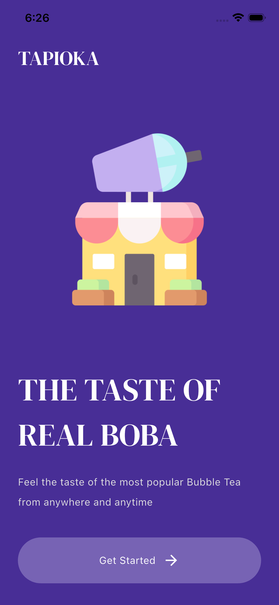
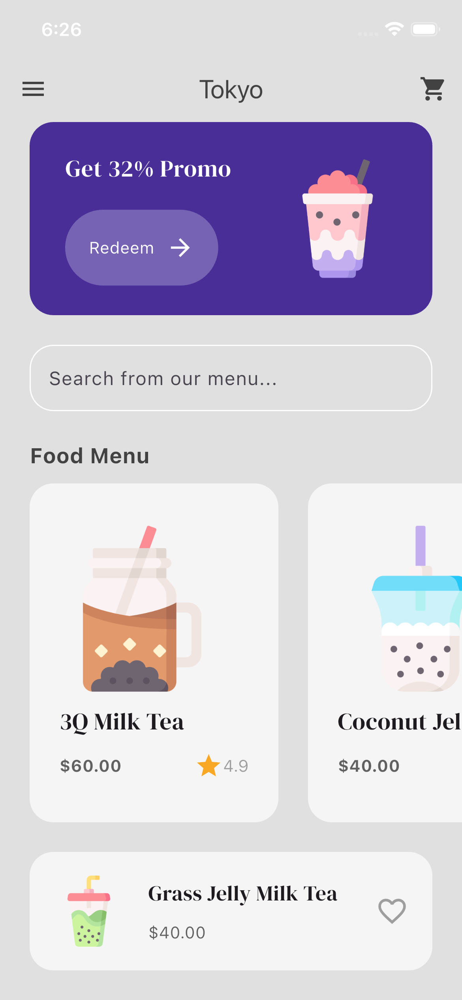
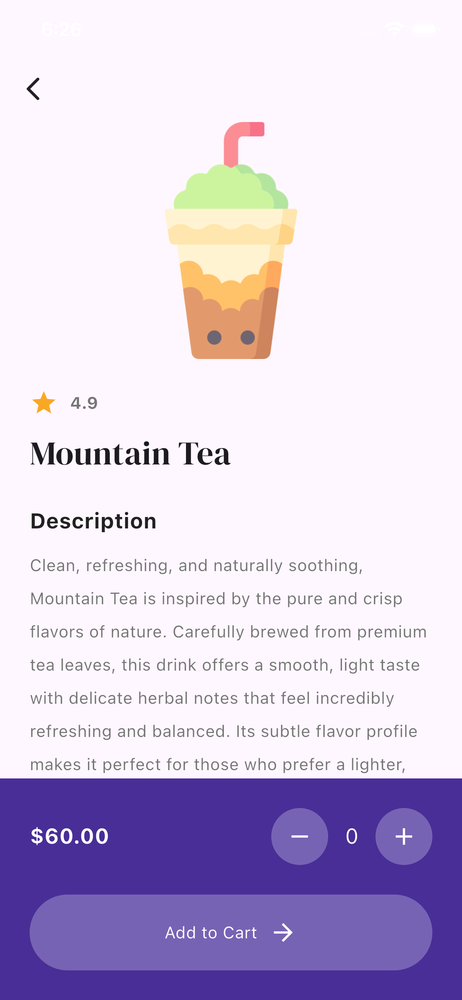
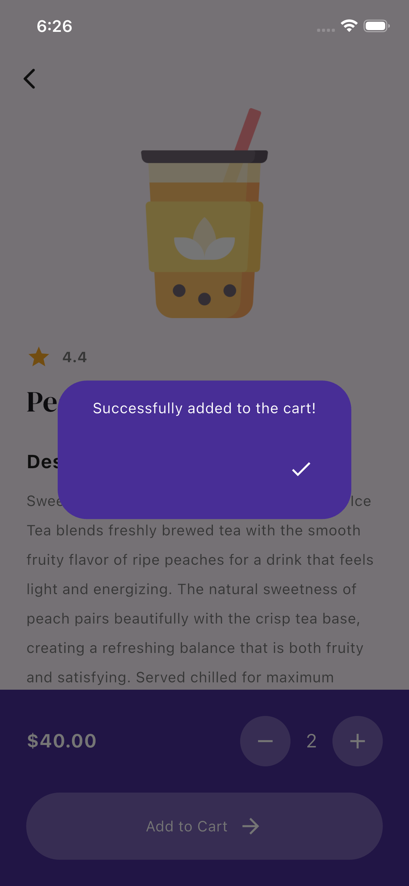
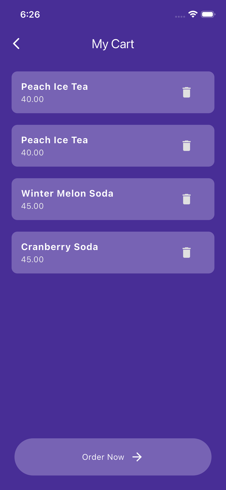
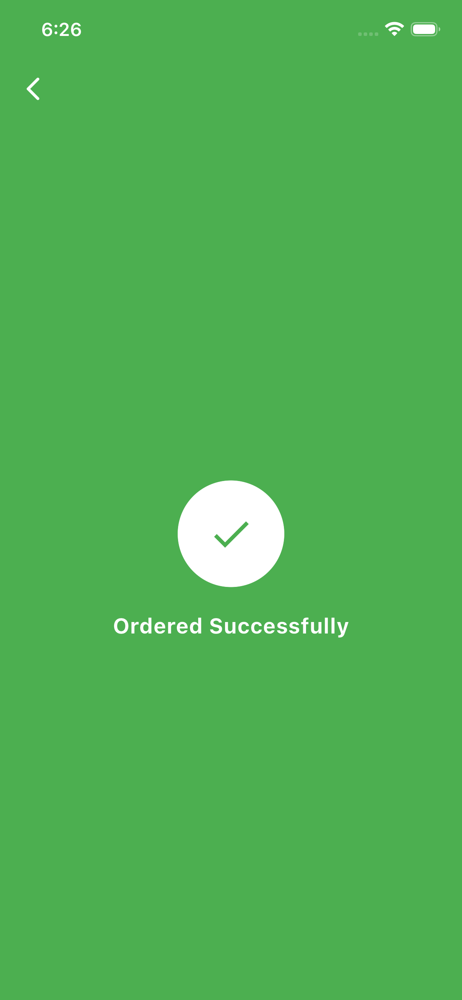

# TAPIOKA

Tapioka is a bubble tea shop app made in Flutter. This is my first app in flutter and took a lot time and effort since I had never coded in Flutter before. I made this app as a get-familiar-with-flutter project so that I can start building another big project which is (surprise surprise) an app made with Flutter called 'Stopify'.

I found flutter quite confusing at first. Took some time to get the hang of it. I can see now why people call it similar to working with html/css divs.

P.S still looking for a good formatter for flutter. lmk if you know any good ones.

## Features
- intro page
- main menu page
    - navbar (sort of) with cart page icon
    - horizontal scrolling menu items
    - search bar (not working, just a text field)
    - popular liked items
- food details page:
    - add to cart button
    - quantity count widget
    - adding to cart produces a success message and takes back to main menu page instead of food deatils page
- cart page:
    - delete items from cart
    - order now button (takes to order page)
- order page:
    - order successful message displayed

## DEMO VIDEO:

## Screenshots

intro page

main menu page

food details page

add to cart success popup

cart page

order successful page

## Credits
- made by me
- link to icon pack: 
- Gemini AI: to help explain flutter concepts/code chunks found online
- ChatGPT: generated item descriptions for food_details_page
- Some random image of cafe menu on my sister's phone: giving menu item names to the downloaded icon pack images